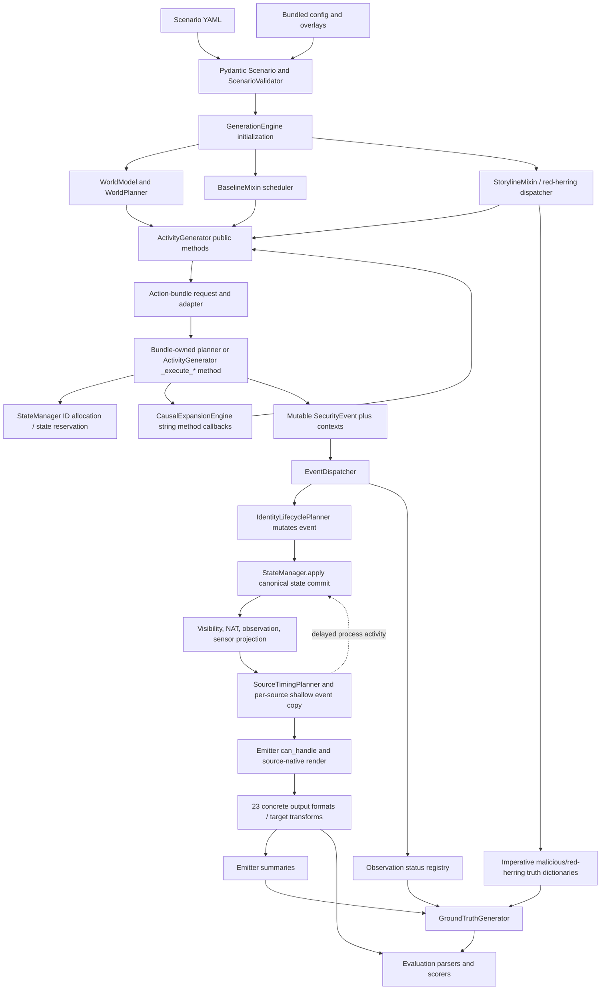
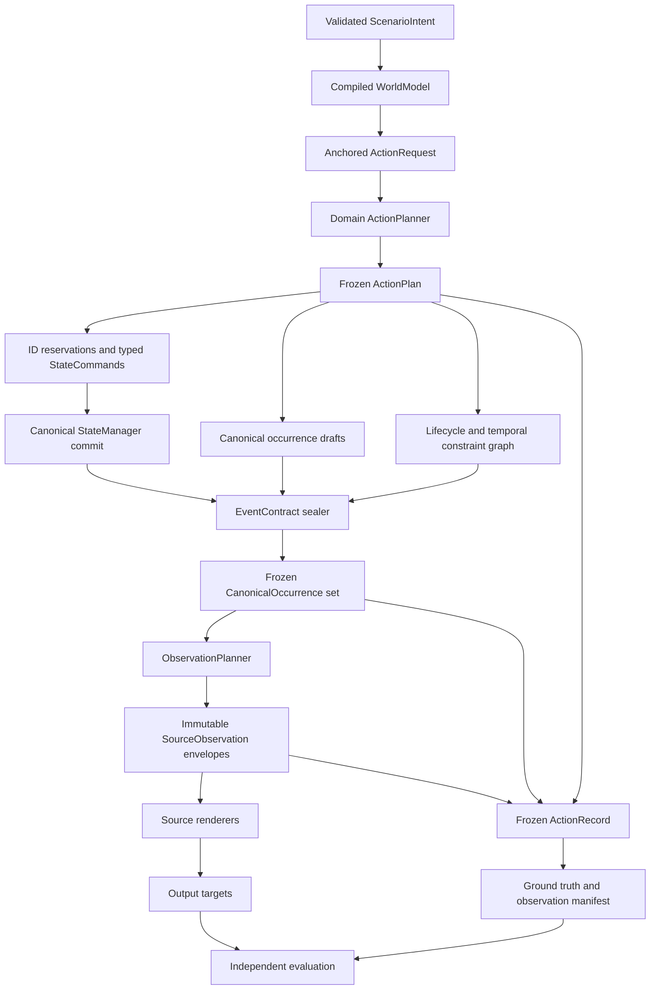

# Architecture and Object-Model Assessment

Status: architecture gate accepted 2026-08-05

Baseline: `dev` at `0a035e97d94cd2a35ebd1498cc4e133336fe14a4`

Review date: 2026-08-05

## Gate decision

EvidenceForge should retain the accepted evolutionary-reset direction, but the reset cannot yet be
treated as an enforced architecture. Its major concepts are present—typed authored intent, a
compiled world model, action bundles, canonical events, durable state, immutable transaction and
identity plans, observation policy, source timing, visibility/NAT, and source renderers. The
remaining problem is that these concepts do not form one closed ownership chain.

The implementation is best described as a capable transitional architecture:

- The scenario model is strongly validated, while the internal event model is permissive.
- Some bundles genuinely own an action; many others are adapters back into a 22,407-line
  `ActivityGenerator`.
- Some shared truth is frozen in immutable plans; the surrounding event and compatibility
  contexts remain mutable and can carry a second version of the same truth.
- Canonical state is committed before observation, but source-delayed timestamps later feed back
  into that state.
- Timing is modeled with useful constraint graphs, but the full constraint system is distributed
  across bundles, generator clamps, a stateful source planner, dispatcher special cases, and a few
  renderer-local calculations.
- Ground truth and observation accounting are correlated with events, but are still assembled as
  a parallel imperative data model instead of being one output of the action plan.

The architecture gate therefore **passes with required direction**: proceed with the exhaustive
review against the target architecture and migration order below. Do not declare the architecture
reset complete, and do not begin fixes until the full audit is accepted.

## Scope and method

This gate reconciles the accepted architecture-reset documents with the current implementation. It
covers the object model and ownership flow from validated scenario intent to rendered evidence and
evaluation inputs. It does not yet claim path completeness for every event type or source-native
fidelity for every format; those are the next gated phases.

Static inspection covered:

- scenario Pydantic models and cross-reference validation;
- `GenerationEngine`, baseline, storyline, red-herring, and startup orchestration;
- `WorldModel`, `WorldPlanner`, action bundles, causal expansion, and `ActivityGenerator`;
- `SecurityEvent`, all context families, immutable plans, runtime state, identity, and lifecycle;
- canonical network planning, traffic accounting, visibility, NAT, observation, and source timing;
- dispatcher routing and all 23 concrete emitter registrations;
- ground-truth construction and the evaluation boundary;
- accepted architecture requirements, recommendation, implementation plan, and current reference
  documentation.

Three small read-only runtime probes tested invalid-event admission, event-ID stability, and causal
failure behavior. A fourth behavior—source-observation time feeding process state—is already an
explicit unit-test contract. Commands and results are in the focused worklog.

## Actual implemented dependency flow

The dashed edge is the most important boundary violation found in this gate: source observation
can change durable runtime lifecycle state after the canonical commit.

## Ownership assessment

| Concern | Intended owner | Actual owner(s) | Assessment |
| --- | --- | --- | --- |
| Authored scenario intent | Pydantic event specs | `models/scenario.py`, `ScenarioValidator` | Strong at the YAML boundary; 31 discriminated event specs. |
| World capabilities and placement | `WorldModel` / `WorldPlanner` | World layer plus retained engine, baseline, storyline, and generator helpers | Partial. The compiled layer is real, but legacy callers still make placement/session decisions. |
| Action lifecycle | One action bundle per real activity | Substantive bundles for SSH/RDP/proxy/browser/network and selected domains; many thin adapters to generator `_execute_*` methods | Partial and inconsistent. Bundle presence does not prove ownership. |
| Durable ID allocation | Planning/generation through `StateManager` APIs | World planner, generator, bundle planners, `StateManager` | Mostly aligned, but action anchors do not become occurrence IDs. |
| Canonical identity roles | State plus identity planner | State allocation, `IdentityLifecyclePlanner`, legacy `EdrContext`, renderer-local source IDs | Partial. Frozen plans exist, but coverage is inferred from string sets and live state. |
| Durable runtime state | `StateManager` | `StateManager`, direct mutable state objects, selected planner/generator writes, dispatcher observation feedback | Partial. Core owner is correct; mutation routes are too broad. |
| Canonical occurrence time | Action/lifecycle planner | Caller timestamps, generator clamps, bundle graphs, network planner event mutation | Split. There is no sealed occurrence-time boundary. |
| Source-native time | Source timing/clock planner | `SourceTimingPlanner`, bundle graphs, observation delay, generator clamps, renderer-local analyzer time | Split and order-sensitive. |
| Observation gaps | Observation layer | `ObservationPolicy`, dispatcher promotion rules, source timing registries, emitter filtering | Partial. Coverage decisions are centralized, but lifecycle coherence is special-cased. |
| Routing and NAT | Visibility/routing layer | `NetworkVisibilityEngine`, dispatcher, sensor projection, ASA renderer | Mostly aligned; the dispatcher mutates routing metadata onto the event after state commit. |
| Traffic accounting | Network action/transaction owner | `NetworkTransactionPlanner`, frozen ledgers/plans, `StateManager.apply`, sensor projections | Strongest canonical slice, but wrapped in a very large planner with mutable compatibility fields. |
| Source-native projection | Emitters | Emitters plus some upstream source-specific message/field construction | Partial. Most shared truth is consumed, but at least one emitter recomputes shared destination identity. |
| Ground truth | Same action model as evidence | Storyline dictionaries, dispatcher observation registry, emitter summaries, `GroundTruthGenerator` | Partial and parallel. |
| Evaluation | Independent consumer of output and truth | `evaluation/` parsers/scorers plus observation manifest | Architectural boundary is appropriate; validity is deferred to the evaluation audit. |

## Requirements reconciliation

| Accepted requirement | Status at baseline | Evidence/qualification |
| --- | --- | --- |
| Deterministic generator with no LLM calls | Satisfied architecturally | The generation pipeline is local and seeded. Full repeatability is deferred to empirical testing. |
| Typed authored events and early validation | Satisfied at input boundary | `EventSpec` is a 31-member discriminated Pydantic union. |
| Canonical `SecurityEvent` with composable contexts | Partial | The carrier exists, but it is mutable, accepts any `event_type`, and has no combination validator. |
| Dual source/destination host semantics | Defined, not enforced | The docstring defines the rule; no central event contract validates it by kind. |
| Two-phase allocate/build/dispatch | Partial | Common paths follow it. The event continues to be enriched and sometimes retimed after construction. |
| `StateManager.apply()` does not allocate IDs | Satisfied | It records lifecycle updates/teardown and network accounting from built events. |
| Compiled world planning shared by baseline/storyline | Partial | The world layer exists; large legacy orchestration surfaces retain overlapping decisions. |
| Composable causal rules | Partial | Rules are centralized, but expansion uses string method names and fails open on exceptions. |
| Explicit action/lifecycle owners | Partial | 51 concrete bundle classes exist, but several lack the common anchor contract and many delegate ownership back to the generator. |
| Explicit temporal constraints | Partial | A reusable constraint graph exists, but it is applied only in selected paths and is supplemented by several other timing mechanisms. |
| Observation separated from rendering | Partial | Policy and planners exist, but dispatcher special cases and source-time-to-state feedback cross the boundary. |
| Emitters do not invent shared truth | Not fully satisfied | Sysmon destination hostname is recomputed from global reverse DNS instead of canonical network hostname truth. |
| Stable evidence anchors resist unrelated churn | Not satisfied for `event_id` | Dispatcher IDs include a global sequence number; action stable IDs are not the occurrence ID. |
| Ground truth comes from the same action/observation model | Partial | Truth dictionaries are separately assembled and later reconciled with dispatcher/emitter summaries. |
| Additional formats avoid duplicated source truth | Partial | Format YAML is declarative, but every current format also has registered Python emitter behavior. |

## Object-model assessment

### Authored intent

The authored model is the strongest validation boundary. The 31 event specifications use a
discriminator on `type`, forbid unknown fields in the common base, and add event-specific Pydantic
validators. This makes schema typos and many impossible authored combinations fail early.

The boundary weakens immediately after dispatch into `_execute_typed_event`, a 2,846-line
`if`/`elif` mapping keyed by `spec.type`. Authored kinds and internal evidence kinds are different
concepts, but there is no explicit mapping object connecting them to bundle, state, lifecycle,
context, emitter, and evaluator contracts. That missing mapping is the central reason the path
census has to rediscover the graph from code.

### `SecurityEvent`

`SecurityEvent` has 55 fields. Only `timestamp` and the free-form string `event_type` are required.
It has 41 payload/context/plan slots before its control and routing metadata is counted. It is a
plain mutable dataclass rather than slotted, frozen, or self-validating.

Consequences:

- A `connection` without `NetworkContext`, or an unknown event kind with no contexts, can be
  dispatched, assigned an ID, and silently produce no evidence.
- Required/optional/forbidden context combinations exist only in constructor conventions and
  individual emitter `can_handle()` methods.
- Host-direction meaning is documented but not enforced per event kind.
- Identity, lifecycle, observation, NAT, source timing, and sensor metadata are attached by
  mutating the occurrence carrier at different pipeline stages.
- `dataclasses.replace()` makes shallow source-specific copies, so mutable contexts and timing
  maps remain shared unless explicitly replaced.

The event also exposes explicit dual representations:

- `ids` and `ids_alerts`;
- `file_transfer` and `file_transfers`;
- `x509` and `x509_chain`;
- mutable `NetworkContext` fields and frozen `NetworkTransactionPlan`;
- mutable `EdrContext` fields and frozen `EventIdentityPlan`;
- mutable protocol contexts and selected frozen TLS, OCSP, proxy, and remote-authentication plans.

Compatibility accessors and validators reduce risk in a few slices, but no general seal verifies
that every projection agrees before routing.

### Mutable context families

`events/contexts.py` contains 38 slotted mutable dataclasses. None has `__post_init__` validation.
Only `NetworkContext.validate_finalized_transaction()` and
`EdrContext.validate_identity_plan()` provide explicit canonical-versus-compatibility checks.

| Context family | Types reviewed | Architectural assessment |
| --- | --- | --- |
| Host and authentication | `HostContext`, `AuthContext` | Host direction and authentication mode are convention-driven. `AuthContext` combines successful session, failed attempt, local/remote, DC, token, and source endpoint concerns in 28 fields with sentinel defaults. |
| Process and thread | `ProcessTargetSecurityContext`, `ProcessContext`, `RemoteThreadContext`, `ProcessAccessContext` | Useful cross-source carrier, but PID/TID/object ownership can be supplied in both contexts and frozen identities. Validity depends on live state and caller discipline. |
| Network | `NetworkContext` | Best-developed context. It owns a frozen transaction snapshot and validates drift at dispatch, but remains mutable before and after snapshot creation and mixes canonical tuple/accounting with compatibility and source-visible fields. |
| DNS and mail | `DnsContext`, `EmailContext`, `SmtpContext` | Rich protocol truth with mutable lists and many optional/sentinel values. Cross-context legality is not enforced centrally. |
| Host artifacts | `FileContext`, `RegistryContext`, `ImageLoadContext`, `ShellContext` | Small and composable; actor/process/session requirements remain implicit. |
| IDS | `IdsDetectionFilterContext`, `IdsEventFilterContext`, `IdsAlertPolicyContext`, `IdsContext` | Separates rule/policy detail, but singular/list attachment and network-parent requirements are compatibility conventions. |
| Service and audit | `SyslogContext`, `WeirdContext`, `KerberosContext`, `ServiceContext`, `ScheduledTaskContext`, `GroupMembershipContext`, `AccountManagementContext` | Carries source/event-specific data but has no event-kind or OS/host legality validation. |
| Protocol and transfer | `SslContext`, `HttpContext`, `FileTransferContext`, `X509Context`, `DhcpContext`, `NtpContext`, `OcspContext`, `PeContext`, `ProxyContext` | Detailed source fan-out is possible, but mutable compatibility contexts coexist with selected immutable plans; parent/child and list membership invariants are checked ad hoc. |
| Endpoint and routing | `EdrContext`, `FirewallContext`, `NatContext` | `EdrContext` can validate a frozen identity projection. Firewall/NAT placement and tuple compatibility are dispatcher/renderer conventions. |
| Escape hatch | `RawContext` | Appropriate only for explicitly non-correlated, single-source output; it must remain outside canonical guarantees. |

Many fields use `""`, `0`, or `-1` to mean unknown/not applicable. Those values are sometimes
also legal source-native values. The model cannot consistently distinguish unknown, intentionally
suppressed, not observed, not applicable, and actual zero without reading event-type-specific
code.

### Immutable plans and identities

The newer immutable layer is a material improvement:

| Domain | Types reviewed | Assessment |
| --- | --- | --- |
| Identity | `ThreadIdentity`, `ProcessIdentity`, `SessionIdentity`, `EventIdentityPlan` | Frozen and mostly validated. Planning coverage is inferred from internal event-type sets and available state; missing state yields a missing plan rather than a contract failure. |
| Lifecycle | `SessionEndPlan`, `ActionLifecycleContext` | Frozen and validated. It models useful start/closure grouping, but not every stateful family receives it. |
| Network | `DirectionalTrafficLedger`, `NetworkTrafficLedger`, `NetworkTuple`, `NetworkSensorObservation`, `NetworkTransactionPlan` | Strong invariants and source projection. This is the best template for the rest of the model. |
| Remote authentication | `RemoteAuthenticationTransportPlan`, `RemoteAuthenticationPlan` | Frozen cross-event transport/auth truth with validation. |
| Cryptography | `CertificateAuthorityMaterial`, `CertificateIdentityPlan`, `TlsCertificatePresentationPlan`, `DkimKeyPlan`, `OcspTransactionPlan` | Strong plan-level ownership; compatibility projection still lives in mutable protocol contexts. |
| Proxy | `ProxyTransactionPlan` | Frozen transaction truth and validation; higher-level proxy action remains coupled to generator/network services. |
| Time | `TimingSpec`, `TemporalConstraint`, `TemporalNode`, `TemporalConstraintGraph`, `SourceTimingPlan` | The graph validates local constraints. `SourceTimingPlan` and nodes are mutable, and graph use is not universal across action families. |
| World | `HostWorld`, `UserWorld`, `DatabaseEndpoint`, `SessionPlan`, `SessionBootstrapResult` | Frozen compiled decisions. Legacy helpers and direct mutable session updates limit its authority. |

The target should extend this pattern, not replace it. Immutable plans need one sealing boundary and
must become authoritative rather than optional companions to writable compatibility state.

### Runtime state

`ActiveSession`, `RunningProcess`, `RunningThread`, `OpenConnection`, and `GeneratorState` are
intentionally mutable runtime containers. `StateManager` wraps many operations with a lock and
provides scoped allocation/lookups, which is the correct core ownership choice.

The risks are at the boundary:

- Callers retain and directly mutate returned session/process objects in the world, baseline, and
  activity layers.
- Both planning code and `StateManager.apply()` update activity/close/accounting fields.
- The dispatcher updates `RunningProcess.last_activity_time` once per admitted emitter using that
  emitter's delayed timestamp.
- State transitions are selected by free-form event-type strings rather than declared state
  effects.

State should remain mutable and centralized, but mutation should be possible only through typed
commands whose time domain is explicit (`canonical`, never source-observation).

### Action bundles

The repository has 51 concrete classes named `*ActionBundle`. The substantive slices prove the
architecture can work: SSH, RDP, explicit proxy, browser sessions, network transactions, remote
administration, file transfer, Linux session/shell activity, and selected cryptographic work have
meaningful planning logic in their action modules.

The abstraction is not uniform:

- Process, auth, DNS, DHCP, Kerberos, Windows audit, scanner, and email families commonly delegate
  straight back to `ActivityGenerator._execute_*_bundle` methods.
- Three concrete bundle classes (email delivery, email access, and OCSP transaction) do not expose
  the common `ActionAnchor` property.
- `ActionBundle.execute()` is declared as returning `str`, while concrete bundles return IDs,
  plans, result objects, dictionaries, booleans, or `None`.
- The `ActionBundle` protocol is exported but is not used as the enforced orchestration boundary.
- Stable request IDs are usually calculated, yet emitted occurrences do not consistently carry
  their action anchor and role.

The implementation-plan statement that all action-bundle slices are complete is true as routing
coverage, but not as ownership extraction.

### Timing and observation

EvidenceForge has several good mechanisms: immutable canonical network intervals, action-specific
constraint graphs, deterministic source clock profiles, observation profiles, coherent grouping,
sensor projections, and output-window admission.

They currently overlap:

- Action bundles use `TemporalConstraintGraph` for selected SSH/RDP/proxy/session sequences.
- `ActivityGenerator` applies process/session visibility clamps.
- `NetworkTransactionPlanner` can move the canonical event timestamp before freezing the network
  transaction.
- `SourceTimingPlanner` keeps mutable registries of previously admitted Kerberos, session,
  transport, and process source rows.
- `EventDispatcher` promotes source-local parents and successful SSH/RDP companions through
  format-specific special cases.
- Observation delay is implemented by replacing `event.timestamp` for a shallow event copy.
- Some emitters calculate analyzer/source-local timestamps.

This produces correct behavior in many tested families, but it is not a declarative action-wide
constraint system. Correctness can depend on dispatch order, which source was enabled/admitted,
and whether a prior source row populated a planner registry.

## Architecture findings

Priorities are review priorities (P0–P4), not security severities. These findings are not fixes and
will be carried into the final finding register only after the later path/dynamic audits confirm
their full recurrence and sibling risk.

### ARCH-001 — Internal event contracts are not centrally defined or enforced

- Classification: current correctness defect and architectural root cause
- Priority: P1
- Confidence: high
- Violated invariant: every canonical occurrence has a known kind, legal host direction, and a
  validated required/optional/forbidden context set before state or rendering.
- Evidence: `events/base.py:85-198` accepts a free `event_type: str` and optional contexts without a
  validator; `events/dispatcher.py:208-300` assigns an ID and dispatches without an event contract;
  emitter eligibility is distributed through `can_handle()` implementations.
- Reproduction: the worklog probe dispatches `event_type="connection"` without `NetworkContext`;
  it succeeds, receives an ID, and returns no evidence.
- Affected paths: every internal constructor, direct bundle dispatch, causal callback, raw-like
  compatibility path, state transition, emitter, and evaluator assumption.
- Owning layer: canonical event model / dispatch admission.
- Recurrence: systemic.
- Sibling risk: silent evidence loss, partial fan-out, wrong host semantics, missing lifecycle,
  and new internal kinds forgotten by one or more consumers.
- Proposed remediation: introduce a declarative `EventContract` registry in audit-only mode, then
  seal every draft against it before state commit. Keep authored kinds separate from internal
  occurrence kinds.
- Required tests: contract completeness, invalid-combination rejection, registry-to-emitter/state/
  evaluator coverage, and one negative fixture per contract family.

### ARCH-002 — Source-observation time mutates canonical process lifecycle state

- Classification: current correctness defect
- Priority: P1
- Confidence: high
- Violated invariant: observation gaps/delay may change source records, not the canonical facts or
  lifecycle of the modeled world.
- Evidence: `events/dispatcher.py:266-296` creates a source-delayed event and passes its timestamp
  to `StateManager.update_process_activity_time()` inside the per-emitter loop. The behavior is
  asserted by `tests/unit/test_dispatcher.py:418-493` with a 900,000 ms Sysmon delay.
- Affected paths: every admitted non-termination occurrence carrying `ProcessContext` and
  `src_host`; effect size depends on enabled formats and observation profile.
- Owning layer: dispatcher/state boundary, with lifecycle planning as the downstream consumer.
- Recurrence: systemic for process-attributed source output.
- Sibling risk: process termination and session closure move when a format is enabled, filtered,
  dropped, or delayed; format-filtered runs can change later canonical generation rather than only
  output projection.
- Proposed remediation: commit canonical activity/close constraints once from occurrence time or
  canonical interval. Track collector/clock/source timing only in an observation envelope. A
  delayed collected row must not lengthen real process life.
- Required tests: profile and format changes leave canonical state and all unaffected formats
  identical; delayed source records preserve their source-native semantics without changing
  canonical termination.

### ARCH-003 — Mutable compatibility truth can diverge from immutable canonical plans

- Classification: architectural risk with localized drift protection
- Priority: P1
- Confidence: high
- Violated invariant: one owner and one authoritative value for every shared fact.
- Evidence: `SecurityEvent` is mutable and carries singular/list duplicates plus both mutable
  contexts and immutable plans. `NetworkTransactionPlanner.execute()` constructs an event and then
  assigns numerous contexts (`network_transaction_planner.py:1590-1635` and later); dispatcher,
  identity, and timing layers add more metadata. Only network and EDR projections have explicit
  cross-checks.
- Affected paths: network/protocol/file/IDS/TLS fan-out, endpoint identity, and any source using a
  compatibility field rather than the plan.
- Owning layer: canonical object model.
- Recurrence: systemic, especially high-fan-out connection events.
- Sibling risk: a new source consumes the legacy field while another consumes the frozen plan;
  shallow source copies share mutable lists/maps; explicit suppression is confused with unknown.
- Proposed remediation: introduce a mutable draft followed by a frozen sealed occurrence. Make
  immutable plans authoritative and generate compatibility views once at sealing. Replace
  singular/list pairs with canonical tuples and compatibility properties during migration.
- Required tests: post-seal mutation rejection, projection equivalence, shallow-copy isolation,
  sentinel-state tests, and all-consumer reads from the declared owner.

### ARCH-004 — Action-bundle coverage is not action ownership

- Classification: architectural risk and implementation-status drift
- Priority: P1
- Confidence: high
- Violated invariant: a bundle owns action identity, lifecycle, timing, state effects, and all
  canonical occurrences regardless of baseline/storyline/red-herring entry path.
- Evidence: 51 concrete bundle classes exist, but common process/auth/DNS/DHCP/Kerberos/Windows
  audit classes have four-line `execute()` adapters to generator `_execute_*` methods. Examples are
  `actions/process_execution.py:115-166` and `actions/auth_session.py:312-520`; the corresponding
  generator implementations include `_execute_process_create_bundle` (725 lines),
  `_execute_dns_lookup_bundle` (527), and `_execute_logon_bundle` (502). Email/OCSP bundles omit the
  common anchor, and bundle return contracts vary.
- Affected paths: all families still implemented in the generator plus any alternate entry path
  that can bypass the nominal bundle.
- Owning layer: action domain.
- Recurrence: systemic but uneven; SSH/RDP/proxy/network are more mature.
- Sibling risk: parallel baseline/storyline behavior, hidden callbacks, incomplete anchor
  propagation, and a false sense that a family has one owner because a wrapper exists.
- Proposed remediation: require an anchored `ActionPlan`/`ActionResult` contract, move execution
  behind explicit service ports, and make `ActivityGenerator` a compatibility façade rather than
  the implementation owner.
- Required tests: enumerate every entry path to one bundle owner, assert identical action plans for
  equivalent intent, and reject direct construction outside declared adapters.

### ARCH-005 — Timing and observation correctness is distributed and order-sensitive

- Classification: architectural risk
- Priority: P1
- Confidence: high
- Violated invariant: all causal/lifecycle/source timing constraints for an action resolve from an
  explicit graph independent of enabled renderer order.
- Evidence: `TemporalConstraintGraph` is used in only selected action/source paths;
  `SourceTimingPlanner` maintains admitted-event registries; dispatcher methods at
  `events/dispatcher.py:415-506` promote source companions through format-specific logic; source
  copies share the mutable `SourceTimingPlan`.
- Affected paths: SSH/RDP, Kerberos, process/session closure, proxy/browser, network companions,
  observation profiles, output windows, and format filtering.
- Owning layer: action timing and observation planning.
- Recurrence: cross-cutting.
- Sibling risk: adding, removing, dropping, or reordering one format changes the anchors available
  to later source rows; unmodeled event families receive weaker guarantees than migrated slices.
- Proposed remediation: have each action plan declare canonical nodes, lifecycle bounds, causal
  edges, and source-observation groups. Resolve immutable per-source projections after canonical
  state commit with no registry side channel into later canonical planning.
- Required tests: emitter-order permutation, format-subset equivalence, profile metamorphic tests,
  lifecycle containment, and constraint coverage for every stateful family.

### ARCH-006 — Causal expansion is stringly typed and fails open

- Classification: current correctness defect
- Priority: P1
- Confidence: high
- Violated invariant: required causal evidence either expands successfully or generation fails
  with an actionable error.
- Evidence: `ExpandedEvent.method` and `kwargs` are untyped strings/dictionaries
  (`generation/causal/engine.py:90-100`); `_expand_and_emit()` calls `getattr(self, ev.method)`
  (`activity/generator.py:8738-8739`); `CausalExpansionEngine.expand()` catches `Exception`, logs,
  and continues (`causal/engine.py:133-139`).
- Reproduction: the worklog's injected failing rule logs `RuntimeError: probe` and returns `[]`.
- Affected paths: DNS-before-connection, Kerberos-before-logon, process-access prerequisites, and
  supplementary audit expansion.
- Owning layer: causal action planning.
- Recurrence: any rule implementation or callback signature failure.
- Sibling risk: successful generation with missing prerequisites, misleading ground truth, and
  non-local breakage after method renames.
- Proposed remediation: typed expansion commands or bundle requests, validated at registration;
  fail closed for required rules and allow explicitly classified optional enrichment failures only.
- Required tests: registration signature validation, required-rule exception propagation,
  optional-rule diagnostics, and negative rename/type fixtures.

### ARCH-007 — Sysmon recomputes shared destination hostname outside the network owner

- Classification: current canonical-consistency defect
- Priority: P1
- Confidence: high static trace; dynamic recurrence count deferred
- Violated invariant: destination hostname is selected once and reused by DNS, TLS, HTTP, proxy,
  endpoint, and network consumers.
- Evidence: `NetworkTransactionPlan.hostname` is the frozen network truth, including deliberate
  empty-hostname suppression. `SysmonEventEmitter._resolve_destination_hostname()` imports global
  `REVERSE_DNS` and recomputes from `dst_ip` (`emitters/sysmon.py:739-749`); Event 3 calls it at
  `sysmon.py:1508`.
- Affected paths: Sysmon Event 3 for internal, explicit raw-IP, proxy, SMTP, and any dynamically
  registered reverse-DNS destination.
- Owning layer: canonical network transaction; source projection should only choose native null
  morphology.
- Recurrence: every admitted Sysmon network event.
- Sibling risk: an intentionally suppressed hostname can reappear, or Sysmon can disagree with
  canonical DNS/SNI/proxy hostname.
- Proposed remediation: after the audit, project `transaction.hostname` (with explicit
  unknown/suppressed semantics) into Sysmon rather than consult global DNS state.
- Required tests: canonical hostname, unknown hostname, deliberately suppressed hostname, SMTP
  alias policy at the owner, and cross-source equality.
- Proof gap: the static owner/consumer contradiction is complete; rendered recurrence and affected
  scenario families will be quantified in the event/path and empirical phases.

### ARCH-008 — Dispatcher event IDs churn when unrelated events are inserted

- Classification: current design defect
- Priority: P2
- Confidence: high
- Violated invariant: stable evidence identities should survive unrelated scenario evolution when
  the owning action occurrence is unchanged.
- Evidence: `EventDispatcher` includes `_event_sequence` in `stable_uuid()`
  (`events/dispatcher.py:137, 221-229`). Action requests often expose stable IDs, but those anchors
  are not used to derive the occurrence ID.
- Reproduction: the worklog probe produces different IDs for the same target type/timestamp when
  an unrelated event is dispatched first.
- Affected paths: every event without a preassigned `event_id`; eCAR/Snort metadata and any future
  ground-truth reference that uses it.
- Owning layer: action identity / canonical occurrence sealing.
- Recurrence: systemic.
- Sibling risk: large output diffs, fragile instructor references, and observation decisions that
  incorporate event identity changing after unrelated additions.
- Proposed remediation: derive occurrence IDs from action anchor, occurrence role, and a stable
  role-local ordinal; use sequence only for explicitly unanchored compatibility events.
- Required tests: unrelated insertion/removal, format filtering, seed stability, repeated action
  roles, and collision tests.

### ARCH-009 — Ground truth is a parallel imperative model

- Classification: architectural risk
- Priority: P2
- Confidence: high
- Violated invariant: scenario truth, generated occurrences, observation status, and rendered
  references are projections of the same action record.
- Evidence: `_execute_typed_event()` initializes and mutates a `malicious_event` dictionary
  independently of the emitted action (`engine/storyline.py:3009+`); dispatcher tracks source
  status in a separate registry; emitters provide late summaries; `GenerationEngine` reconciles
  them before `GroundTruthGenerator`.
- Affected paths: all storyline/red-herring events, filtered network UIDs, IDS totals, artifacts,
  and any event family whose generator behavior changes without a matching truth-dictionary edit.
- Owning layer: action result / truth projection.
- Recurrence: all authored event types.
- Sibling risk: truth claims evidence that was not generated, omits generated dependents, or
  references a sensor-local ID selected by special-case code.
- Proposed remediation: every executed action returns a frozen `ActionRecord` containing anchor,
  intent summary, occurrence roles/IDs, lifecycle, artifact references, and observation handles;
  ground truth and manifest render from those records.
- Required tests: action-record completeness, truth-to-output reference resolution, observation
  profile metamorphism, and one bad truth fixture per family.

### ARCH-010 — Architecture documentation overstates completed boundaries

- Classification: documentation drift
- Priority: P2
- Confidence: high
- Violated invariant: architecture guidance must identify the actual owner and extension work.
- Evidence: `docs/ARCHITECTURE.md:251` says 27 contexts while `contexts.py` contains 38;
  `docs/design/architecture-reset-recommendation.md:30` describes a roughly 17k-line generator
  now measured at 22,407; the implementation-plan status says bundle slices and final boundary
  audit are complete while many bundles remain compatibility adapters; `AGENTS.md:661` says a new
  format requires only YAML while `_build_emitter_classes()` has an explicit 23-entry Python map.
- Affected paths: maintainers, code reviewers, new formats, and future architecture work.
- Owning layer: architecture/reference documentation.
- Recurrence: ongoing as code evolves.
- Sibling risk: changes are placed in the nominal rather than actual owner; path reviews omit
  Python wiring; completion status hides migration debt.
- Proposed remediation: after the full audit, replace numeric/absolute claims with generated
  inventories where possible and distinguish “entry routed through bundle” from “ownership
  extracted.”
- Required tests: documentation inventory checks generated by the review utility.

## Target architecture

The target is an incremental evolution of current code, not a greenfield rewrite.

### Required ownership contracts

1. **`EventContract` registry**

   Each internal occurrence kind declares required, optional, and forbidden contexts; source and
   destination host roles; identity roles; lifecycle phase; typed state effect; observation group;
   permitted source families; and raw/correlation status. Authored event types map to one or more
   action requests, not directly to this registry.

2. **Mutable draft, immutable occurrence**

   Preserve builder ergonomics with `SecurityEventDraft` (or an internal equivalent). Seal it once
   into the current `SecurityEvent` or a new `CanonicalOccurrence`. After sealing, canonical time,
   contexts, identities, lifecycle, and shared IDs cannot be changed. Dispatcher routing metadata
   moves out of the occurrence.

3. **Anchored `ActionPlan` and `ActionRecord`**

   Every bundle exposes an `ActionAnchor` and returns a common result containing occurrence roles,
   lifecycle, state commands, temporal constraints, and ground-truth handles. Domain-specific
   result fields can compose with the common result.

4. **Typed state commands**

   State allocation/reservation and state commit remain in `StateManager`, but callers do not
   mutate returned session/process objects directly. Every timestamp accepted by canonical state
   is explicitly canonical.

5. **Observation envelope**

   Visibility, NAT tuple view, source clock, collection delay, filtering, source-local identifiers,
   and output-window admission produce immutable source observations. They never mutate canonical
   state or the canonical occurrence.

6. **Projection-only renderers**

   Emitters receive a sealed occurrence plus one source observation. They may compute only
   source-local morphology (record IDs, field formatting, precision, native nulls) and may not
   consult global lookup pools for facts already owned by the occurrence/action.

7. **Truth from action records**

   Ground truth and observation manifests render from the same action/occurrence/observation
   records as logs. Evaluation remains an independent output consumer.

## Incremental migration order

This order is dependency-driven and preserves public scenario, CLI, bundle layout, and format
names until separately approved.

### M0 — Complete the review and contract census

- Build the event/context/path matrix and reproducible probe utility.
- Record current behavior without changing it.
- Turn the resulting inventory into the initial `EventContract` data set.

Exit: every kind/context/plan/bundle/constructor/state/emitter/evaluator path has an owner and a
classification.

### M1 — Add shadow contract validation and action-role IDs

- Introduce internal typed occurrence kinds and an audit-only contract registry.
- Attach action anchor plus occurrence role/ordinal to events while retaining current `event_id`.
- Report violations in tests/review probes before making them fatal.

Exit: the registry covers all observed internal kinds and can reproduce the path matrix.

### M2 — Seal canonical occurrences

- Formalize draft versus sealed event state.
- Freeze canonical payloads at dispatch admission.
- Make network/identity/crypto/proxy plans authoritative and generate read-only compatibility
  projections.
- Remove singular/list ambiguity behind compatibility accessors.

Exit: no canonical field changes after sealing; invalid combinations fail before state commit.

### M3 — Separate canonical state from source observation

- Split dispatcher responsibilities into canonical commit, observation planning, and rendering
  routing.
- Remove per-emitter state mutation.
- Move NAT/sensor/source timing metadata into immutable observation envelopes.
- Add emitter-order, format-subset, and profile metamorphic tests.

Exit: changing formats or observation profile cannot change canonical state or unaffected source
output.

### M4 — Standardize bundle plans and extract high-fan-out owners

- Require anchors and a common `ActionPlan`/`ActionRecord` result for every concrete bundle.
- Keep `ActivityGenerator` public methods as adapters.
- Extract in dependency order:
  1. process execution/termination and auth/logon/logoff;
  2. DNS and causal prerequisites;
  3. Kerberos/DC and Windows audit;
  4. scanners, IDS, DHCP, email, and OCSP;
  5. consolidate already substantive SSH/RDP/network/proxy/browser/file-transfer slices against the
     common contract.
- Split `NetworkTransactionPlanner.execute()` into tuple/transport, protocol, accounting,
  visibility intent, and dependent-artifact planners without duplicating ownership.

Exit: no concrete bundle delegates its domain implementation to an `_execute_*_bundle` method on
the compatibility façade.

### M5 — Resolve action-wide temporal and lifecycle graphs

- Make each action plan declare canonical occurrence nodes, prerequisites, dependents, lifecycle
  bounds, and source observation groups.
- Replace admitted-source registries and dispatcher companion promotions with resolved action/source
  constraints.
- Retain source-local analyzer timing only as declared projection constraints.

Exit: every stateful family has start/dependent/closure containment and format-order-independent
source timing.

### M6 — Unify ground truth and evaluation references

- Generate truth and observation manifests from `ActionRecord`s.
- Resolve every source-local evidence reference through observation handles.
- Update evaluators to consume declared contracts without becoming generator-specific.

Exit: every truth reference resolves to canonical action truth and correctly represents visible,
dropped, filtered, delayed, or out-of-window evidence.

### M7 — Remove compatibility surfaces and refresh documentation

- Delete legacy fields/adapters only after all callers and tests use the sealed contracts.
- Generate documentation inventories and extension checklists from the registry.
- Preserve `raw` as a clearly isolated, non-correlated escape hatch.

Exit: documentation matches generated inventories and the compatibility façade no longer owns
domain behavior.

## Gate questions for acceptance

Approval of this gate means:

1. Treat the ten findings as the architecture hypotheses/root causes to test exhaustively, not as
   authorization to fix them now.
2. Use the target architecture and M0–M7 order as the reference for classifying path bypasses and
   building the final remediation roadmap.
3. Continue into the exhaustive path census, cross-cutting audits, empirical campaign, blind
   reviews, and scoped security review without another planned pause.

If accepted, the next artifact will be the machine-readable event/context path matrix and its
coverage summary. No implementation change will occur during that work.

## Acceptance note

The user approved this architecture course on 2026-08-05 and authorized the remaining review
campaign. Contract proposals may be completed as review deliverables, but no contract or migration
implementation may begin until the user separately reviews and approves those proposals.
